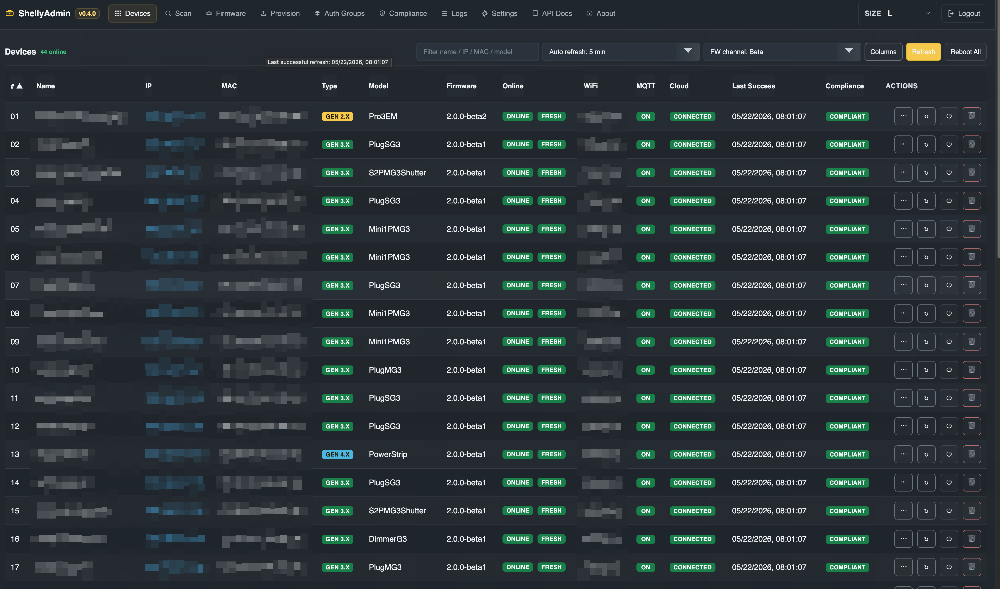
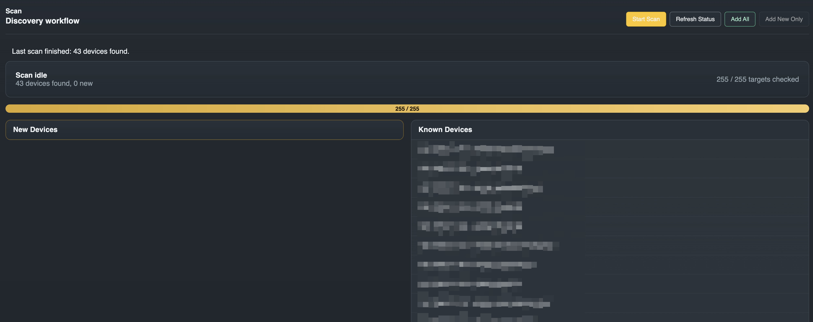
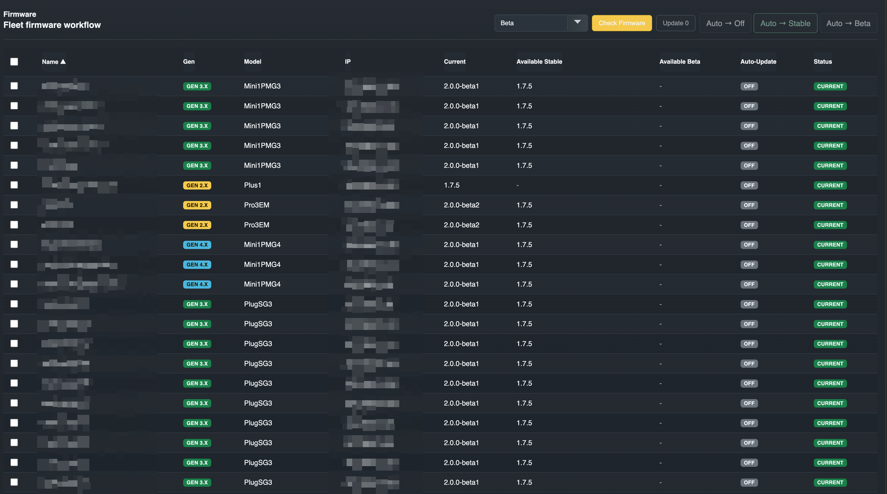
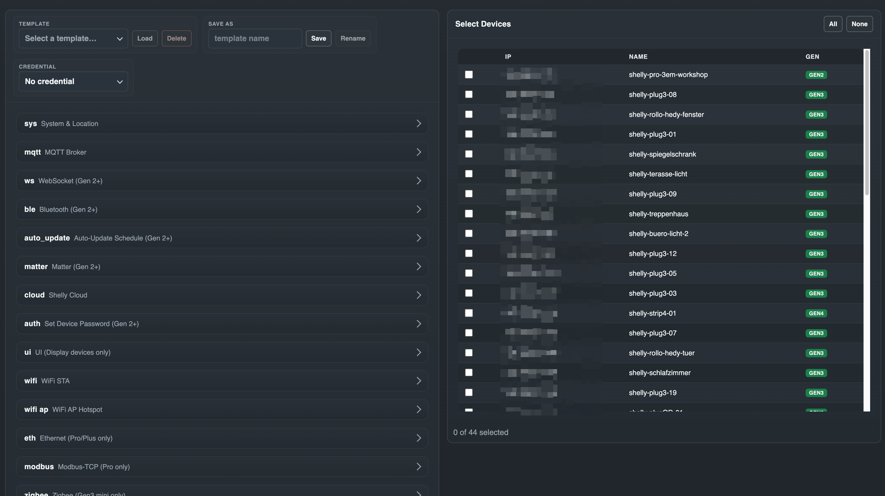
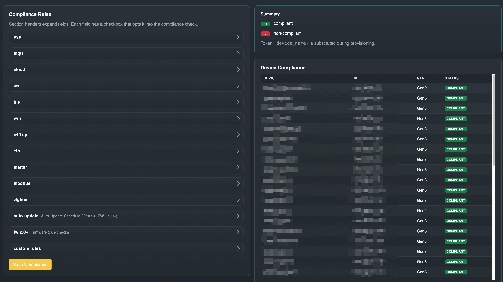

# ShellyAdmin

[English](README.md) | **Deutsch**

[](https://github.com/buliwyf42/shellyadmin/actions/workflows/test.yml)
[](LICENSE)
[](https://github.com/buliwyf42/shellyadmin/releases)
[](https://github.com/buliwyf42/shellyadmin/pkgs/container/shellyadmin)
[](https://goreportcard.com/report/github.com/buliwyf42/shellyadmin)

ShellyAdmin ist eine selbst gehostete Web-Anwendung zum Entdecken, Inventarisieren, Überprüfen und Verwalten von Shelly-Geräten der Generation 2+ in einem vertrauenswürdigen lokalen Netzwerk.

## Warum ShellyAdmin?

Die Shelly-Cloud verlangt, dass jedes Gerät einzeln in einen Drittanbieter-Dienst eingebunden wird. Die Shelly-Integration in Home Assistant deckt Steuerung, Automatisierung und eine Pro-Entity-Ansicht ab, jedoch keine flottenweite Firmware-Verwaltung, kein Compliance-Audit, keine Massen-Provisionierung und kein Audit-Log der Bediener-Aktionen. ShellyAdmin steht neben diesen Werkzeugen als **Flotten-Ops-Konsole**: ein Subnetz scannen, Geräte in ein Inventar aufnehmen, Konfigurations-Vorlagen auf viele Geräte gleichzeitig anwenden, Firmware in größerem Umfang prüfen/installieren und sicherstellen, dass jedes Gerät einem definierten Compliance-Regelwerk entspricht — jede Aktion wird protokolliert.

Die Anwendung ist als Einzel-Container-Deployment ausgelegt mit:

- gestaffelter Geräte-Erkennung vor der Aufnahme ins Inventar
- zuletzt beobachtetem Gerätezustand in SQLite
- manuellen Workflows für Firmware und Provisionierung
- Compliance-Prüfungen gegen konfigurierte Regeln
- geführter Provisionierung für den Normalfall
- erweitertem Provisionierungsmodus für Experten
- Audit-Logging in der Anwendung



<details>
<summary>Weitere Screenshots: Scan, Firmware, Provisionierung, Compliance</summary>

### Scan — Discovery-Workflow



### Firmware — flottenweit prüfen und installieren



### Provisionierung — Konfigurations-Template anwenden



### Compliance — Regel-Editor und Geräte-Status



</details>

## Status

In aktiver Entwicklung. Aktuelles Release ist `v0.5.3` (Härtung: `shellyctl rotate-key`, Größenlimits + JSON-RPC-Envelope-Validierung für Geräteantworten, Template-Section-Validierung, Race-Detector in CI + Frontend-Coverage-Gate); die UI/API-Baseline ist seit `v0.4.0` unverändert. Das Projekt folgt vor v1.0 dem SemVer-Schema mit Vorbehalt: Minor-Versionen können Breaking Changes enthalten. SemVer-Garantien gelten ab `v1.0.0`.

Eingeplantes Einsatzprofil:

- experimentell, aber für die Administration in einem vertrauenswürdigen LAN nutzbar
- optimiert für einen einzelnen vertrauenswürdigen Operator
- nicht für direkte Exposition ins Internet gedacht
- noch nicht als Multi-User- oder HA-fähige Plattform positioniert

Die Ziel-Architektur ist in [docs/ARCHITECTURE.md](docs/ARCHITECTURE.md) dokumentiert.

## Ziele

- einfach in Docker zu betreiben
- optimiert für einen einzelnen vertrauenswürdigen Operator im LAN
- Unterstützung für Shelly-Geräte ab Generation 2+ (Gen1 wird bewusst nicht unterstützt)
- riskante Aktionen bleiben manuell und mit Vorschau

## Schnellstart

Schnellster Docker-Aufruf für ein Test-Setup im vertrauenswürdigen LAN:

```bash
docker run -d \
  --name shellyadmin \
  -p 8080:8080 \
  -v shellyadmin-data:/data \
  -e SHELLYADMIN_SECRET="$(openssl rand -hex 32)" \
  -e SHELLYADMIN_ENCRYPTION_KEY="$(openssl rand -base64 32)" \
  -e COOKIE_SECURE=false \
  ghcr.io/buliwyf42/shellyadmin:latest
```

Anschließend `http://localhost:8080` öffnen und auf dem **Ersteinrichtungs-Bildschirm** das Administrator-Konto anlegen. Passwort vergessen? `docker exec shellyadmin shellyctl reset-auth --force` setzt die Instanz wieder in den Setup-Modus zurück.

`SHELLYADMIN_ENCRYPTION_KEY` ist seit v0.3.0 **zwingend erforderlich** — der Container startet ohne ihn nicht. Einmal generieren und bei jedem Recreate **denselben Wert wiederverwenden**; ein ohne Rotation getauschter Schlüssel verwaist alle gespeicherten Anmeldedaten. Für einen geplanten Schlüsselwechsel gibt es `shellyctl rotate-key` (v0.5.3) — siehe [docs/SECURITY.md](docs/SECURITY.md).

`COOKIE_SECURE=false` ist nur über reines HTTP im vertrauenswürdigen LAN unbedenklich. Für jede andere Bereitstellung `COOKIE_SECURE=true` setzen (und dem Container TLS vorschalten).

### Login vorab setzen (optional)

Um den Einrichtungs-Bildschirm bei einer frischen Instanz zu überspringen, einen Hash erzeugen und als `SHELLYADMIN_PASS_HASH` übergeben:

```bash
HASH="$(docker run --rm ghcr.io/buliwyf42/shellyadmin:latest hash-password 'change-this-admin-password')"

docker run -d \
  --name shellyadmin \
  -p 8080:8080 \
  -v shellyadmin-data:/data \
  -e SHELLYADMIN_SECRET="$(openssl rand -hex 32)" \
  -e SHELLYADMIN_ENCRYPTION_KEY="$(openssl rand -base64 32)" \
  -e SHELLYADMIN_PASS_HASH="$HASH" \
  -e COOKIE_SECURE=false \
  ghcr.io/buliwyf42/shellyadmin:latest
```

Der Hash wird beim ersten Start einmalig in die Datenbank importiert und danach ignoriert. Passwort später ändern: in der Oberfläche unter Einstellungen → Operator-Konto.

### Docker Compose

Für ein Compose-basiertes Deployment siehe [`docker/docker-compose.yml`](docker/docker-compose.yml):

```bash
docker compose -f docker/docker-compose.yml up -d
```

Den vollständigen Deployment-Leitfaden — inklusive Härtungs-Flags, MCP-Exponierung und Pre-Deploy-DB-Snapshots — gibt es unter [docs/DEPLOYMENT.md](docs/DEPLOYMENT.md).

## Aktueller Funktionsumfang

- Scan mit Staging und expliziter Übernahme ins Inventar
- Geräte-Inventartabelle mit sortierbaren Spalten und nutzerspezifischer Spaltensichtbarkeit
- Bulk-Aktionen mit Vorschau/Anwenden für Zeitzone, MQTT, Standort, SNTP und Reboot
- Auto-Refresh in der Geräteansicht (30 s, 1 min, 5 min)
- separate Timeouts für Scan und Refresh in den Einstellungen
- optionale mDNS-gestützte Erkennung zusätzlich zum Subnetz-Scan
- Aktionen pro Geräte-Zeile in der Geräteansicht:
  - sofortiger Refresh
  - Reboot pro Zeile (⏻) mit Inline-Spinner
  - Löschen/Entfernen
- Toolbar-Button „Reboot All“ für Bulk-Reboots
- Detailansicht pro Gerät mit:
  - Roh-Snapshots von Config und Status
  - erkannten Fähigkeiten (Capabilities)
  - sicheren Einzelgerät-Aktionen (Refresh, Firmware prüfen/aktualisieren, Reboot)
- gebietsschema-bewusste Zeitdarstellung (relativ/absolut) in Geräteliste und Detailansicht
- „Veraltet"-Signal pro Zeile, wenn der letzte Refresh-Versuch fehlschlägt
- Compliance-Status in der Geräteansicht inklusive Hover-Details
- manueller Firmware-Check und Update-Flow:
  - Pro Gerät, pro Kanal zwischengespeicherte Verfügbarkeit (Stable + Beta in einem einzigen Check)
  - sortierbare Firmware-Seite mit „Alle auswählen"-Logik und Bestätigungs-Modal vor Bulk-Installationen
  - dedizierter Install-Job mit Pro-Gerät-Versionsabgleich; sowohl Timeout (Standard 300 s) als auch Poll-Intervall (Standard 5 s, Bereich 1–60) sind in den Einstellungen konfigurierbar
  - Bulk-Auto-Update-Schalter (Off / Stable / Beta) — umgesetzt über `Schedule.*`, denselben Mechanismus, den auch das Web-UI des Geräts selbst verwendet
  - gemeinsamer Stable-/Beta-Kanal-Schalter zwischen Firmware- und Geräteseite (in localStorage persistiert)
- geführtes Provisionierungs-Formular plus JSON-Modus mit kontextbezogener Template-Verwaltung (Laden, Speichern, Löschen, Umbenennen):
  - vollständige `Wifi.SetConfig`-Oberfläche: primäre STA, sekundäre STA (STA1), Roaming (RSSI-Schwelle, Intervall), statische IPv4 je STA
  - Script-Section (Schleife pro ID), UI.SetConfig, Ethernet IPv6/DNS
  - `auto_update`-Section (off / stable / beta) — wird auf dem Gerät als `Schedule.*`-Job synthetisiert
  - **Webhooks**-Formular (v0.2.4): `delete_all`-Schalter, Löschen per ID, Neuanlage (cid/event/name/enable/URLs)
  - **Cover**-Formular (v0.2.5): id, name, maxtime open/close, swap_inputs, power_limit und das FW-2.0.0-beta1-`slat`-Sub-Objekt für Jalousie-Lamellen
  - **Zigbee-Operations**-Formular (v0.2.6): überwiegend schreibende Karten für `Zigbee.SendCommand` / `Zigbee.ReadAttr` / `Zigbee.WriteAttr`, erzeugt einen `gen2_rpc`-Template-Abschnitt
  - `restart_required`-Badge pro Gerät in den Ergebnissen; Schaltfläche „Reboot restart-required devices"
- Seite „Auth-Gruppen":
  - Gruppen führen ihre eigenen Zugangsdaten (`username`, `password`/`ha1`, Tags)
  - Zuordnung Gerät ↔ Gruppe für künftige auth-pflichtige Workflows
- Validierung der Provisionierungs-Ziele (nur lokale, private oder link-local IPs)
- Compliance-Regel-Editor (inklusive Token-Matching `{device_name}`)
- Backup-Export/-Import mit Dry-Run und Apply:
  - Einstellungen
  - Templates
  - Auth-Gruppen
  - Gerät-Gruppen-Zuordnungen
- Audit-Logs (Debug-Log-Modus entfernt)
- dokumentierte API-Oberfläche und OpenAPI-JSON für die unterstützten v1-Routen
- optionaler schreibgeschützter [MCP-Server](#optional-mcp-server-nur-lesend) für LLM-gestützte Introspektion

## Roadmap

Siehe [docs/roadmap.md](docs/roadmap.md) für die aktuelle Roadmap. Headline-Punkte:

- breitere Action-Erkennung für Gerätekomponenten, sobald die Protokoll-Unterstützung verlässlich ist
- `shellyctl`-Write-Commands (Read-Only-CLI ist seit v0.3.6 verfügbar)
- API-Stabilitätsgarantie ab `v1.0.0`

## Projektstruktur

```text
cmd/shellyctl        Einstiegspunkt der Anwendung (Server + CLI-Unterkommandos)
internal/api         HTTP-Routing und Handler
internal/services    Workflow-Orchestrierung
internal/core        Shelly-Protokoll-Logik (Scanner, Firmware, Provisioner)
internal/mcp         schreibgeschützter MCP-Server (HTTP- und Stdio-Transport)
internal/db          SQLite-Persistenz und Migrationen
internal/models      gemeinsame Datenmodelle
web                  Svelte-Frontend
docker               Container-Dateien
docs                 Architektur-, Deployment- und ADR-Dokumentation
```

## Lokal ausführen

Voraussetzungen:

- Go 1.25+ (`go.mod`-Floor; CI und Docker-Build nutzen die Go-1.26-Toolchain)
- Node 22+ (CI und Docker-Build nutzen Node 26)

In zwei Terminals:

```bash
# Terminal 1 — Backend auf :8080
make dev-backend

# Terminal 2 — Frontend-Dev-Server auf :5173 (proxyt /api und /health)
cd web
npm install
npm run dev
```

`http://localhost:5173` öffnen und mit `admin` / `dev-secret` anmelden.

Soll die Go-Binary mit eingebetteten Frontend-Assets statt des Vite-Dev-Servers laufen:

```bash
make frontend   # Frontend bauen + nach cmd/shellyctl/dist synchronisieren
make backend
./bin/shellyctl
```

Die vollständige Entwickler-Referenz (Tests, Lint, Bundle-Größen-Budget, Deployment-Workflow, Release-Prozess) steht in [docs/DEVELOPMENT.md](docs/DEVELOPMENT.md).

## Docker

ShellyAdmin läuft als einzelner Container. Getaggte Releases veröffentlichen ein Multi-Arch-Image auf GHCR via `.github/workflows/publish-image.yml`:

- `ghcr.io/buliwyf42/shellyadmin:vX.Y.Z` (unveränderlich)
- `ghcr.io/buliwyf42/shellyadmin:latest` (wandert mit)

Die Beispiel-Compose-Datei unter [`docker/docker-compose.yml`](docker/docker-compose.yml) zieht standardmäßig `:latest`. Statt zu pullen lokal bauen:

```bash
docker compose -f docker/docker-compose.yml up -d --build
```

Den vollständigen Deployment-Leitfaden gibt es in [docs/DEPLOYMENT.md](docs/DEPLOYMENT.md).

## Optional: MCP-Server (nur lesend)

ShellyAdmin kann einen schreibgeschützten [Model-Context-Protocol](https://modelcontextprotocol.io)-Server bereitstellen, damit LLM-gestützte Agenten (Claude Desktop, Claude Code, eigene MCP-Clients) die Flotte introspektieren können — Geräte auflisten, Scan-/Firmware-Status prüfen, Compliance lesen, Logs einsehen — ohne die SPA zu scrapen. Zustandsverändernde Operationen (Refresh, Scan, Firmware-Update, Provisionierung, Settings-Writes) sind in v1 bewusst nicht freigegeben; siehe [docs/adr/0011-mcp-read-only-server.md](docs/adr/0011-mcp-read-only-server.md).

Der Listener ist **standardmäßig aus** und lässt sich entweder über `SHELLYADMIN_MCP_TOKEN` (Umgebungsvariable; hat Vorrang — praktisch für headless / CI / Compose-verwaltete Deployments) aktivieren oder über **MCP-Server → Aktivieren** auf der Settings-Seite, indem dort ein Token hinterlegt wird (seit v0.1.20; im Ruhezustand verschlüsselt gespeichert). Sind beide gesetzt, gewinnt die Umgebungsvariable, und die Settings-UI zeigt den Hinweis „managed by environment variable". Clients können sich entweder über den Standard-Header `Authorization: Bearer <token>` **oder** durch Anhängen des Tokens als erstes URL-Pfad-Segment authentifizieren (z. B. `http://host:8081/<token>/`) — praktisch für Clients wie `mcp-remote`, bei denen ein Header-Argument unhandlich ist.

| Umgebungsvariable       | Standard      | Zweck                                                                                     |
| ----------------------- | ------------- | ----------------------------------------------------------------------------------------- |
| `SHELLYADMIN_MCP_TOKEN` | nicht gesetzt | Wird zum Aktivieren von MCP benötigt. Unterstützt `_FILE`-Indirektion wie andere Secrets. |
| `SHELLYADMIN_MCP_PORT`  | `8081`        | Port für den MCP-Listener.                                                                |
| `SHELLYADMIN_MCP_BIND`  | `0.0.0.0`     | Bind-Adresse. Auf `127.0.0.1` setzen für reinen Loopback-Zugriff.                         |

Beispiel-Konfiguration für Claude Desktop (`mcp.json`) — Header-Variante:

```json
{
  "mcpServers": {
    "shellyadmin": {
      "url": "http://your-shellyadmin-host:8081/",
      "headers": { "Authorization": "Bearer your-token-here" }
    }
  }
}
```

Derselbe Client über `mcp-remote` (der kein Header-Feld nativ anbietet) mit der URL-Pfad-Variante:

```json
{
  "mcpServers": {
    "shellyadmin": {
      "command": "npx",
      "args": [
        "-y",
        "mcp-remote",
        "http://your-shellyadmin-host:8081/your-token-here",
        "--allow-http"
      ]
    }
  }
}
```

Bei aktiviertem MCP schreibt jeder Tool-Aufruf in dasselbe Audit-Log, das die SPA auf der Logs-Seite anzeigt (mit Präfix `mcp `, filterbar nach Request-ID).

## Sicherheit

Dieses Projekt ist für den Einsatz in vertrauenswürdigen LANs gedacht, nicht für direkte Internet-Exposition. Der Meldeweg und die Versions-Support-Policy stehen in [SECURITY.md](SECURITY.md); das tiefere Threat-Model und die Deployment-Erwartungen in [docs/SECURITY.md](docs/SECURITY.md).

Eine Sicherheitslücke gefunden? Bitte als [private Security Advisory](https://github.com/buliwyf42/shellyadmin/security/advisories/new) melden.

## Architektur

Dokumentiert in:

- [docs/ARCHITECTURE.md](docs/ARCHITECTURE.md) — Gesamtentwurf
- [docs/adr/README.md](docs/adr/README.md) — Architecture Decision Records

## Mitwirken

Das Projekt ist noch in Bewegung; Architekturänderungen sollten sich vor der Umsetzung an den dokumentierten Design-Zielen orientieren. Entwicklungs- und PR-Workflow in [CONTRIBUTING.md](CONTRIBUTING.md), Verhaltensrichtlinien in [CODE_OF_CONDUCT.md](CODE_OF_CONDUCT.md).

## Lizenz

[MIT](LICENSE) © 2026 buliwyf42
